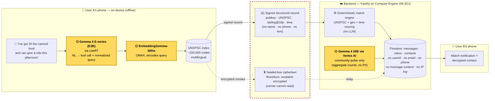

> ## ⚠️ Divergent, non-compliant fork
>
> This repository is a **divergent fork** of [`google-ai-edge/gallery`](https://github.com/google-ai-edge/gallery), maintained for the [**Gemma 4 Good Hackathon**](https://www.kaggle.com/competitions/gemma-4-good-hackathon) on Kaggle.
>
> It is **not compliant** with the upstream project's contribution guidelines and is not intended to be merged back. It carries hackathon-specific additions — a separate Fastify backend (`backend/`), a UNSPSC search skill with bundled on-device embedding models, mutual-aid community skills (`community-need`, `community-offer`, `community-match`, `community-inbox`, `community-connect`, `community-pulse`, `community-cancel`), and Vertex AI (Gemma 4 MaaS) integration.
>
> For the canonical upstream project, see [google-ai-edge/gallery](https://github.com/google-ai-edge/gallery). Upstream issues should be filed there, not here.
>
> ---

# Gratitude

**Peer-to-peer mutual aid coordination, built on Gemma 4.**

[](LICENSE)
[](https://www.kaggle.com/competitions/gemma-4-good-hackathon)
[](https://github.com/google-ai-edge/gallery)

Two neighbors. One has something to offer — food, a ride, an hour of company. One needs something. Right now, matching them takes days of phone trees, Facebook posts, and clipboards at the church — and the people who get help are mostly the people who already know who to call. **Gratitude does that matching in seconds**, on the phones people already have, for anything one neighbor can offer and anything another can need.

The motivating scenario is disaster response (e.g. the September 4 2025 Mesa County flooding), but the system is built for everyday mutual aid — disasters are the sharp edge of a continuous problem.

## How it works



Gratitude is a two-tier system. Both tiers run Gemma 4.

### On-device (Gemma 4 E-series, via LiteRT)

The user says, in plain language: *"I've got fifty pounds of canned food and can give somebody a ride to the clinic this afternoon."*

A Gemma 4 E-series model running on-device (LiteRT, no network) classifies that utterance into one or more structured records — a UNSPSC category, a quantity, a time window, an approximate location. The user's actual words never leave their phone. Only the structured record does.

The on-device tier is implemented as a set of [Agent Skills](skills/) — modular SKILL.md files plus webview-hosted JS — that the Gemma model invokes when the user describes a need, an offer, a cancellation, a match check, or a gratitude pulse. See [Community skills](#community-skills-on-device) below.

### Self-hosted backend (Fastify on Compute Engine, Gemma 4 via Vertex AI MaaS)

The backend receives signed structured messages, runs geographic + categorical matching, and brokers encrypted contact-sharing between parties. The matching tier uses the larger Gemma 4 weights via Vertex AI Model-as-a-Service for the harder semantic work the on-device model can't do.

The Compute Engine + Vertex deployment is a deployment choice, not an architectural commitment. The protocol is server-fungible: the same wire format could run on community-owned infrastructure, federated across communities, with G4 SMS squirts or on a BLE mesh. See [backend/README.md](backend/README.md) for endpoints, Firestore schema, and deployment.

The backend exposes a small, well-defined surface — every state-changing call is signed, and Gemma is only invoked from one endpoint:

| Method | Path | What it does |
|---|---|---|
| `POST` | `/v1/messages/submit` | Store a signed `anonymized`, `text`, or `public_contact_unencrypted` message |
| `GET` | `/v1/messages/poll` | Poll the inbox for a public key |
| `POST` | `/v1/connect/match` | Deterministic UNSPSC + geo + time matching across the caller's posts |
| `POST` | `/v1/connect/pulse` | Gemma-generated 2–3-sentence community pulse over the last seven days (the only Vertex call) |
| `POST` | `/v1/contact/share` | Relay a libsodium-sealed encrypted contact blob to a reachable recipient |
| `PATCH` | `/v1/inbox/messages/:id/read` | Mark an inbox notification read |
| `POST` | `/v1/records/delete` | Cryptographically authorized deletion of a stored message or contact relay |
| `GET` | `/health` | Liveness probe |

Full request/response shapes, the deterministic match scoring rules, and the Firestore schema (the privacy claim made auditable) are in [backend/README.md](backend/README.md).

## Privacy boundaries

**The server cannot see:**

- User names, phone numbers, or any identity information
- Free-form message text (there is none on the wire — only structured fields)
- Contact info shared between matched parties (sealed-box encrypted on-device to the recipient's ephemeral key before transmission)
- Any stable identity-to-message linkage (each post is signed with a fresh Ed25519 keypair)

**The server can see:**

- Approximate location (lat/long with 2 decimal precision abstracts this)
- Message timing
- UNSPSC categories of offers and needs
- Public-key reuse within a session
- The implicit social graph of who-matches-with-whom

The server is structurally incapable of reading message contents or learning identities.

## Gemma 4 usage

**Gratitude is only possible because of Gemma 4 — end-to-end.** Two Gemma 4 models run on-device in series. The E-series LLM takes the user's free-form words and rewrites them into a normalized query plus the right structured tool call. **EmbeddingGemma-300m** then encodes that query and matches it against a pre-computed index of every UNSPSC code in the extended taxonomy (~150,000 codes, indexed offline by [`tools/unspsc-indexer`](tools/unspsc-indexer)), so the user's utterance is tagged with the correct code before anything is transmitted. Both halves are Gemma 4, and we tried this with everything else we could plausibly ship on a phone: prior E-series weights and the leading open small LLMs all showed tool-call format drift, hallucinated UNSPSC codes, and silently-dropped fields on the generator side; no other small embedding model we tested came close on retrieval. **Gemma 4 is the first model family where both halves are good enough at the same time** — and EmbeddingGemma gives us multilingual coverage for free, which matters for the mutual-aid audience.

The hand-curated peer-aid surface — segment 93 extensions for rides, informal childcare, peer emotional support, accompaniment, harm reduction — was the part that had to be near-flawless for the app to feel real. Our latest eval ([`tests/unspsc-search/reports/2026-05-11T20-31-20-356Z.md`](tests/unspsc-search/reports/2026-05-11T20-31-20-356Z.md)) bears this out:

| Slice | Mean score | n | Notes |
|---|---|---|---|
| **Community (peer-aid extensions)** | **100.0** | 33 | Every query lands at the correct UNSPSC class. |
| Broad (standard UNSPSC) | 87.2 | 150 | Standard taxonomy across 16 segments. Misses concentrate in genuinely ambiguous categories (e.g. "tax help" splits across two valid families). |
| Overall | 89.5 | 183 | |

The 100% on community codes is the load-bearing number for the pitch. The 87% on standard UNSPSC is honest and good enough — that range covers items where the on-device tier defers to the larger server-side Gemma 4 if higher precision is needed. Without Gemma 4 holding the community surface at 100%, the privacy claims in the next section would collapse: if the small model can't reliably tag the user's words with a code, you end up shipping raw text to the server for classification.

| Where | Model | Runtime | What it does |
|---|---|---|---|
| On-device | Gemma 4 E-series (E2B) | LiteRT (Android) | Classifies natural-language utterances into structured offer / need records via the community-* skills; emits the tool call and the normalized query for embedding lookup |
| On-device | EmbeddingGemma-300m | ONNX in webview (`unspsc-search` skill) | Encodes the query and retrieves the matching UNSPSC code from a pre-built index of the full extended taxonomy. See [`tools/unspsc-indexer`](tools/unspsc-indexer) for the offline indexing pipeline. |
| Backend | Gemma 4 (larger weights) | Vertex AI MaaS | Generates the community-pulse welfare summary |

The on-device model is chosen for **privacy** — the user's words never leave their phone, and tools are called to anonymize all messages. The server-side model is chosen for **capability** — it has the context window and reasoning headroom that the E-series doesn't.

## Message format

UNSPSC is the standard taxonomy with deliberate modifications: professional service codes (segments 82, 83, 84, 85, 90x) are excluded from OFFER messages by design — mutual aid is peer-to-peer, not commodified professional services. Segment 93 is extended with peer-aid categories the standard taxonomy doesn't cover well (rides, informal childcare, peer emotional support, accompaniment, harm reduction). See [`tools/unspsc-indexer/`](tools/unspsc-indexer) for details.

## Community skills (on-device)

Each phase of the lifecycle is implemented as an on-device Agent Skill. The model invokes them when the user's language matches the skill's description.

| Skill | Purpose |
|---|---|
| [`community-need`](Android/src/app/src/main/assets/skills/community-need) | Classify a natural-language request into a structured NEED and post it |
| [`community-offer`](Android/src/app/src/main/assets/skills/community-offer) | Classify a natural-language offer into a structured OFFER and post it |
| [`community-match`](Android/src/app/src/main/assets/skills/community-match) | Trigger deterministic server-side matching against the user's own posts |
| [`community-inbox`](Android/src/app/src/main/assets/skills/community-inbox) | Decrypt and surface pending matches and contact shares |
| [`community-connect`](Android/src/app/src/main/assets/skills/community-connect) | Encrypt the user's contact details to a matched party's session key |
| [`community-pulse`](Android/src/app/src/main/assets/skills/community-pulse) | Gratitude-sharing — confirm a match worked, close the loop |
| [`community-cancel`](Android/src/app/src/main/assets/skills/community-cancel) | Retract an existing offer or need |
| [`unspsc-search`](Android/src/app/src/main/assets/skills/unspsc-search) | On-device embedding lookup over a modified UNSPSC taxonomy |

## Design principles


- **Privacy is architectural, not a feature.** If a privacy claim isn't structurally enforced, we don't make it.
- **No reputation systems.** Trust mechanisms (signature chains, peer attestation, scoring) recreate the worthy/unworthy hierarchies mutual aid explicitly rejects. On-device AI guidance for individual decisions is the alternative we offer.
- **Horizontal participant model.** Individuals, orgs, and institutions all use the same message format. No tiered roles, no verified-account class.
- **Message minimalism.** No free-form text on the wire. Structured fields only. This prevents abuse, keeps messages BLE-sized, and removes a class of harassment vector.
- **Prompting before fine-tuning.** System prompts for fast iteration while values crystallize through community testing. LoRA fine-tuning later, once stable examples exist.

## Repository layout

| Path | What's there |
|---|---|
| [`Android/`](Android/) | Android app (forked from upstream Gallery). The community-* skills are bundled as assets under `app/src/main/assets/skills/`. |
| [`backend/`](backend/) | Fastify + TypeScript backend. Compute Engine VM deployment, Firestore persistence, Vertex AI Gemma 4 integration. See [backend/README.md](backend/README.md). |
| [`skills/`](skills/) | Skill specifications and authoring docs. The community-* skills' canonical source lives here and is mirrored into Android assets. |
| [`tools/unspsc-indexer/`](tools/unspsc-indexer) | Builds the on-device embedding index over the extended UNSPSC taxonomy. |
| [`tests/unspsc-search/`](tests/unspsc-search) | Test cases for the UNSPSC search skill — known utterances mapped to expected categories. |

## Run it yourself

### Backend

```bash
cd backend
npm install
cp .env.example .env  # set GOOGLE_CLOUD_PROJECT
gcloud auth application-default login
npm run dev           # http://localhost:3000
```

Full deployment notes (Cloud Build, Compute Engine VM, Firestore setup): [backend/README.md](backend/README.md).

### Android

```bash
cd Android/src
./gradlew :app:installDebug
```

A HuggingFace OAuth app is required for the model-download flow inherited from upstream — see [DEVELOPMENT.md](DEVELOPMENT.md) for setup.

## Out of scope (deliberately)

- **BLE / mesh networking layer.** The protocol is BLE-sized by design, but the radio layer isn't implemented for the hackathon. Reticulum / LXMF identified as the likely foundation. Post-hackathon work.
- **Server-side fine-tuning.** Currently using Gemma 4 via MaaS with prompting; LoRA later.
- **Federated learning.** Aspirational; in the writeup as future work.
- **Reputation, trust scoring, identity verification.** Excluded by design, not by deferral.

## Built on Google AI Edge Gallery

Gratitude is a fork of [`google-ai-edge/gallery`](https://github.com/google-ai-edge/gallery), which provides the on-device LLM runtime, the Agent Skills framework, and the Android app shell that Gratitude's community-* skills plug into. Without Gallery, the on-device tier would be a much larger build.

Upstream is Apache 2.0; this fork is Apache 2.0. See [LICENSE](LICENSE). The upstream-inherited docs (build instructions, the skill-authoring guide, bug-reporting guide) are preserved unchanged for reference — see `docs/upstream/` if they've been moved out of root.

## License

Apache 2.0. See [LICENSE](LICENSE).
